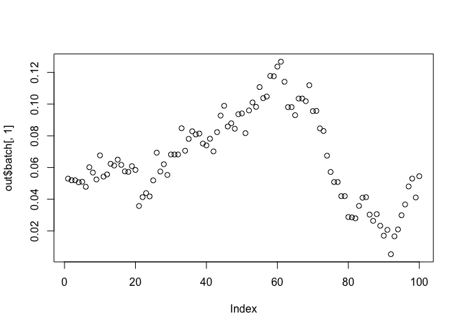
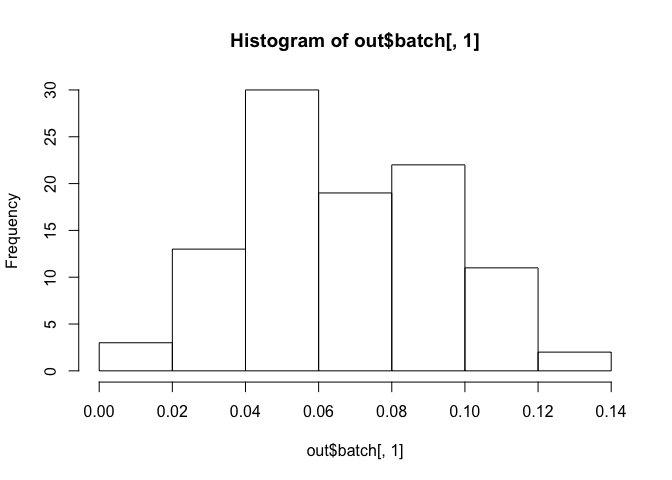

We use Markov chain Monte Carlo (MCMC) algorithm to generate posterior
distribution for a simple function:

    library(mcmc)

    # set initial state of Markov chain
    h <- function(x) if (all(x >= 0) && sum(x) <= 1) return(1) else return(-Inf)
    out <- metrop(h, rep(0, 5), 100)
    out$accept

    ## [1] 0

    # increase accept rate
    out <- metrop(out, scale = 0.01)
    out$accept

    ## [1] 0.64

    # set the nbatch to 100
    out <- metrop(out, nbatch = 1e2)
    out$accept

    ## [1] 0.93

The plot of the 100 generated vectors is shown as following:
  
 The posterior distribution is shown as following:

