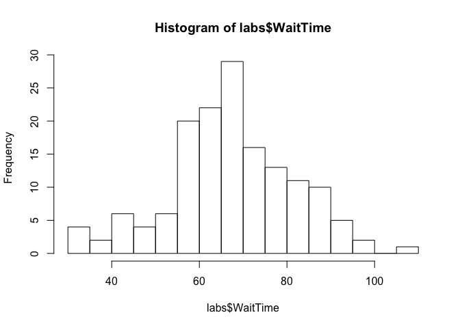
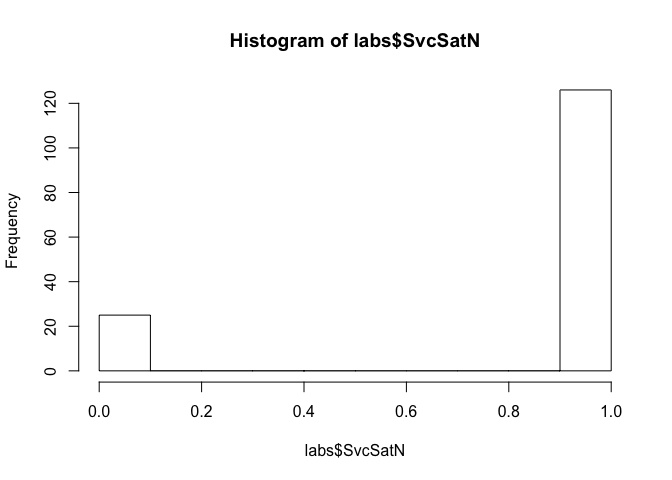
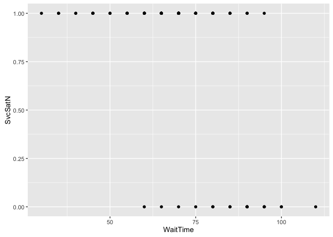
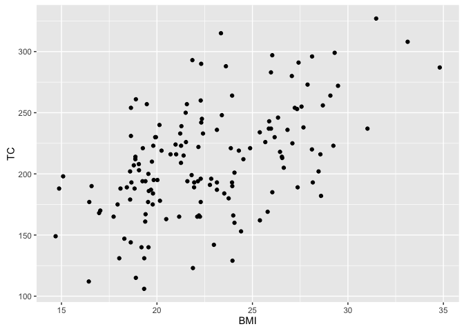

    ## 
    ## (a)(i). WaitTime

    ##    Min. 1st Qu.  Median    Mean 3rd Qu.    Max. 
    ##   30.00   60.00   70.00   69.77   80.00  110.00

    ## sd =  14.37982

    ## KPI for WaitTime is  69.76821  +  14.37982  =  84.14803

  

    ## 
    ## (a)(ii). SvcSat

    ## Let SvcSatN = 1 if SvcSat = Y, otherwise SvcSatN = 0

    ##    Min. 1st Qu.  Median    Mean 3rd Qu.    Max. 
    ##  0.0000  1.0000  1.0000  0.8344  1.0000  1.0000

    ## sd =  0.3729247

    ## KPI for SvcSatN is  0.8344371  + 0.3 * 0.3729247  =  0.9463145

  

    ## 
    ## (b)

    ## Let GdrN = 1 if Gender = M, otherwise GdrN = 0

    ## 
    ## Call:
    ## lm(formula = SvcSatN ~ AGE + GdrN, data = labs)
    ## 
    ## Residuals:
    ##      Min       1Q   Median       3Q      Max 
    ## -0.98897 -0.03686  0.06771  0.17264  0.51381 
    ## 
    ## Coefficients:
    ##              Estimate Std. Error t value Pr(>|t|)    
    ## (Intercept)  1.327333   0.082951  16.001  < 2e-16 ***
    ## AGE         -0.011971   0.002036  -5.880 2.62e-08 ***
    ## GdrN        -0.074997   0.055062  -1.362    0.175    
    ## ---
    ## Signif. codes:  0 '***' 0.001 '**' 0.01 '*' 0.05 '.' 0.1 ' ' 1
    ## 
    ## Residual standard error: 0.3335 on 148 degrees of freedom
    ## Multiple R-squared:  0.2111, Adjusted R-squared:  0.2005 
    ## F-statistic:  19.8 on 2 and 148 DF,  p-value: 2.394e-08

    ## Therefore, statistical evidence suggests that AGE is correlated with SvcSat, while GdrN(Gender) isn't.

    ## 
    ## (c)

  

    ## 
    ## Call:
    ## lm(formula = SvcSatN ~ WaitTime, data = labs)
    ## 
    ## Residuals:
    ##     Min      1Q  Median      3Q     Max 
    ## -0.9685 -0.1058  0.1001  0.1687  0.5119 
    ## 
    ## Coefficients:
    ##              Estimate Std. Error t value Pr(>|t|)    
    ## (Intercept)  1.792204   0.128385  13.960  < 2e-16 ***
    ## WaitTime    -0.013728   0.001803  -7.616 2.79e-12 ***
    ## ---
    ## Signif. codes:  0 '***' 0.001 '**' 0.01 '*' 0.05 '.' 0.1 ' ' 1
    ## 
    ## Residual standard error: 0.3175 on 149 degrees of freedom
    ## Multiple R-squared:  0.2802, Adjusted R-squared:  0.2754 
    ## F-statistic:    58 on 1 and 149 DF,  p-value: 2.793e-12

    ## Therefore, statistical evidence suggests that SvcSat is correlated with WaitTime

    ## 
    ## (d)

    ## BMI = WT/(HT^2)

    ## Manually create a new dataframe 'labsTC.csv' which excludes the rows whose TC = na

  

    ## 
    ## Call:
    ## lm(formula = BMI ~ TC, data = labsTC)
    ## 
    ## Residuals:
    ##     Min      1Q  Median      3Q     Max 
    ## -6.9821 -2.6354 -0.2497  2.3276  8.6411 
    ## 
    ## Coefficients:
    ##              Estimate Std. Error t value Pr(>|t|)    
    ## (Intercept) 12.948711   1.325128   9.772  < 2e-16 ***
    ## TC           0.046059   0.006183   7.450 7.55e-12 ***
    ## ---
    ## Signif. codes:  0 '***' 0.001 '**' 0.01 '*' 0.05 '.' 0.1 ' ' 1
    ## 
    ## Residual standard error: 3.311 on 146 degrees of freedom
    ## Multiple R-squared:  0.2754, Adjusted R-squared:  0.2705 
    ## F-statistic:  55.5 on 1 and 146 DF,  p-value: 7.55e-12

    ## Therefore, statistical evidence suggests that BMI is correlated with TC

    ## 
    ## (e)

    ## Let GdrN = 1 if Gender = M, otherwise GdrN = 0

    ## 
    ## Call:
    ## lm(formula = BMI ~ AGE + SBP + TC + GdrN, data = labsTC)
    ## 
    ## Residuals:
    ##     Min      1Q  Median      3Q     Max 
    ## -7.1376 -2.2762 -0.2834  2.1784  8.9585 
    ## 
    ## Coefficients:
    ##             Estimate Std. Error t value Pr(>|t|)    
    ## (Intercept) 6.609016   2.056543   3.214  0.00162 ** 
    ## AGE         0.023387   0.023138   1.011  0.31384    
    ## SBP         0.058949   0.017417   3.385  0.00092 ***
    ## TC          0.039896   0.006327   6.306 3.36e-09 ***
    ## GdrN        0.086733   0.531686   0.163  0.87065    
    ## ---
    ## Signif. codes:  0 '***' 0.001 '**' 0.01 '*' 0.05 '.' 0.1 ' ' 1
    ## 
    ## Residual standard error: 3.123 on 143 degrees of freedom
    ## Multiple R-squared:  0.3685, Adjusted R-squared:  0.3508 
    ## F-statistic: 20.86 on 4 and 143 DF,  p-value: 1.464e-13

    ## Therefore, there is no statistical evidence suggesting that BMI is correlated with AGE and GdrN. Thus, AGE and GdrN are taken out from the regression.

    ## 
    ## Call:
    ## lm(formula = BMI ~ SBP + TC, data = labsTC)
    ## 
    ## Residuals:
    ##     Min      1Q  Median      3Q     Max 
    ## -6.7815 -2.3248 -0.1846  2.1486  8.6392 
    ## 
    ## Coefficients:
    ##             Estimate Std. Error t value Pr(>|t|)    
    ## (Intercept) 6.063246   1.976431   3.068  0.00257 ** 
    ## SBP         0.067615   0.015066   4.488 1.45e-05 ***
    ## TC          0.042257   0.005875   7.193 3.13e-11 ***
    ## ---
    ## Signif. codes:  0 '***' 0.001 '**' 0.01 '*' 0.05 '.' 0.1 ' ' 1
    ## 
    ## Residual standard error: 3.113 on 145 degrees of freedom
    ## Multiple R-squared:  0.3638, Adjusted R-squared:  0.355 
    ## F-statistic: 41.46 on 2 and 145 DF,  p-value: 5.766e-15

    ## Therefore, BMI = 6.063246 + 0.067615*SBP + 0.042257*TC

    ## Let SBP=135 and TC=150, we get BMI=21.529821

    ## Assumption: (1). AGE, SBP, TC and GdrN are independent. (2). Nation does not affect BMI, or all the data are from Chinese.
