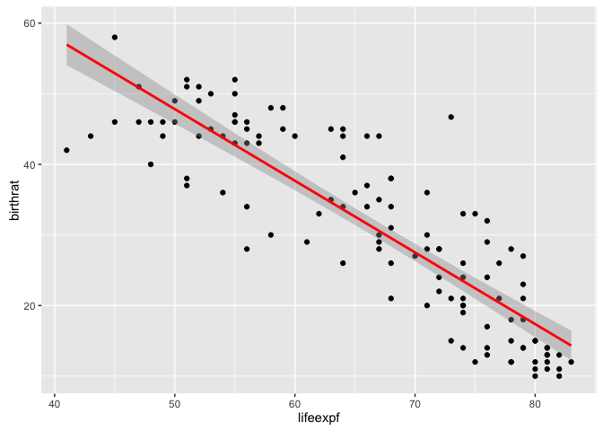

    library(foreign)
    library(ggplot2)
    cty = read.spss("/Users/Yoky/NUS/Year4_Sem2/IS4250/Tutorial/5/country122.sav", to.data.frame=TRUE)

    fit1 <- lm(lifeexpf ~ birthrat, data=cty)
    summary(fit1)

    ## 
    ## Call:
    ## lm(formula = lifeexpf ~ birthrat, data = cty)
    ## 
    ## Residuals:
    ##      Min       1Q   Median       3Q      Max 
    ## -17.3110  -2.6524  -0.0768   3.1784  18.1892 
    ## 
    ## Coefficients:
    ##             Estimate Std. Error t value Pr(>|t|)    
    ## (Intercept) 89.58892    1.31645   68.05   <2e-16 ***
    ## birthrat    -0.74471    0.03878  -19.20   <2e-16 ***
    ## ---
    ## Signif. codes:  0 '***' 0.001 '**' 0.01 '*' 0.05 '.' 0.1 ' ' 1
    ## 
    ## Residual standard error: 5.619 on 119 degrees of freedom
    ##   (1 observation deleted due to missingness)
    ## Multiple R-squared:  0.756,  Adjusted R-squared:  0.754 
    ## F-statistic: 368.8 on 1 and 119 DF,  p-value: < 2.2e-16

    p <- ggplot(cty, aes(x=lifeexpf, y=birthrat))
    p <- p + geom_point()
    p <- p + geom_smooth(method = "lm", colour = "red")
    plot(p)

    ## Warning: Removed 1 rows containing non-finite values (stat_smooth).

    ## Warning: Removed 1 rows containing missing values (geom_point).

  
The relationship between lifeexpf and birthrat is statistically
significant on a 99.9% confidence level. Lifeexpf is expected to
decrease by 0.74471 on average as birthrat increses by one.

    predict(fit1, data.frame(birthrat=25))

    ##       1 
    ## 70.9711

Lifeexpf is expected to be 70.9711 on average when birthrat is 25
provided that other economic variables are similar.

    fit2 <- lm(lifeexpf ~ gdp + urban + hospbed + docs + radio, data=cty)
    summary(fit2)

    ## 
    ## Call:
    ## lm(formula = lifeexpf ~ gdp + urban + hospbed + docs + radio, 
    ##     data = cty)
    ## 
    ## Residuals:
    ##      Min       1Q   Median       3Q      Max 
    ## -17.5811  -3.6979  -0.3803   4.3983  15.6873 
    ## 
    ## Coefficients:
    ##              Estimate Std. Error t value Pr(>|t|)    
    ## (Intercept) 5.391e+01  1.483e+00  36.357  < 2e-16 ***
    ## gdp         1.668e-04  1.616e-04   1.032  0.30415    
    ## urban       1.113e-01  3.516e-02   3.165  0.00201 ** 
    ## hospbed     8.525e-03  3.030e-02   0.281  0.77896    
    ## docs        4.647e-01  1.040e-01   4.468 1.92e-05 ***
    ## radio       4.025e-02  2.725e-02   1.477  0.14257    
    ## ---
    ## Signif. codes:  0 '***' 0.001 '**' 0.01 '*' 0.05 '.' 0.1 ' ' 1
    ## 
    ## Residual standard error: 6.466 on 110 degrees of freedom
    ##   (6 observations deleted due to missingness)
    ## Multiple R-squared:  0.6788, Adjusted R-squared:  0.6642 
    ## F-statistic: 46.49 on 5 and 110 DF,  p-value: < 2.2e-16
